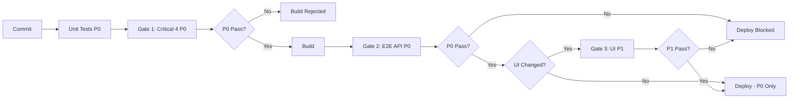

# Steller v2 — Testing Priority Matrix

**Last Updated:** 2026-02-18  
**Authority:** Defines testing priorities. P0 = Critical (always blocking). P1 = Important (conditional blocking).

---

## Priority Definitions

| Priority | Definition | Blocking Behavior |
|----------|------------|-------------------|
| **P0 (Critical)** | API testing, financial invariants, ledger consistency. Core platform correctness. | **Always blocking.** Cannot skip. Build/deploy rejected on failure. |
| **P1 (Important)** | UI testing, dashboard flows. User-facing workflows. | **Conditional blocking.** Only blocks if UI code changed. Skipped for API-only changes. |

---

## Testing Layers by Priority

### P0 (Critical) — Always Blocking

| Layer | Gate | What It Tests | On Failure |
|-------|------|---------------|------------|
| **Unit** | Pre-commit (optional) | Business logic (pricing, validation) | Optional to block commit |
| **Integration** | **Gate 1** | Critical 4: Atomic Rollback, Profit Guard, Idempotency, Concurrency | **Build rejected** |
| **E2E API** | **Gate 2** | API contract, order placement, logs/DB observation | **Deploy blocked** |
| **Ledger** | Production (hourly) | WalletConsistencyJob: `Sum(WalletHistory) == AvailableBalance` | **Alert fired** |

**Rationale:** Financial correctness is non-negotiable. API bugs can cause real money loss. These gates **cannot** be skipped.

---

### P1 (Important) — Conditional Blocking

| Layer | Gate | What It Tests | On Failure |
|-------|------|---------------|------------|
| **UI E2E** | **Gate 3** | Critical user journeys (login, orders, wallet, API keys) | **Deploy blocked** (UI changes only) |

**Rationale:** UI bugs can affect user experience, but API correctness is the foundation. Gate 3 only blocks if UI code changed.

**Conditional Logic:**
- **UI code changed** → Run Gate 3 → Block deploy on failure
- **API-only changes** → Skip Gate 3 → Deploy after Gate 2 passes
- **Backend-only changes** → Skip Gate 3 → Deploy after Gate 2 passes

---

## Priority Enforcement in Pipeline

**Key Points:**
- **P0 gates (Gate 1, Gate 2)** always run and block.
- **P1 gate (Gate 3)** is conditional and can be skipped.
- **API-only deployments** proceed after P0 gates pass, skipping P1.

---

## Decision Matrix

| Scenario | Gate 1 (P0) | Gate 2 (P0) | Gate 3 (P1) | Deploy |
|----------|-------------|-------------|-------------|--------|
| **API-only change** | ✅ Run | ✅ Run | ⏭️ Skip | ✅ Proceed |
| **UI-only change** | ✅ Run | ✅ Run | ✅ Run | ✅ Proceed if all pass |
| **Backend-only change** | ✅ Run | ✅ Run | ⏭️ Skip | ✅ Proceed |
| **API + UI change** | ✅ Run | ✅ Run | ✅ Run | ✅ Proceed if all pass |
| **Gate 1 fails** | ❌ Fail | ⏭️ Skip | ⏭️ Skip | ❌ Blocked |
| **Gate 2 fails** | ✅ Pass | ❌ Fail | ⏭️ Skip | ❌ Blocked |
| **Gate 3 fails (UI changed)** | ✅ Pass | ✅ Pass | ❌ Fail | ❌ Blocked |
| **Gate 3 fails (API-only)** | ✅ Pass | ✅ Pass | ⏭️ Skip | ✅ Proceed |

---

## References

- **QA Plan:** [../STELLER_V2_QA_PLAN.md](../STELLER_V2_QA_PLAN.md)
- **Critical Path:** [QA_CRITICAL_PATH_AND_PIPELINE.md](QA_CRITICAL_PATH_AND_PIPELINE.md)
- **UI Strategy:** [UI_TESTING_STRATEGY.md](UI_TESTING_STRATEGY.md)
