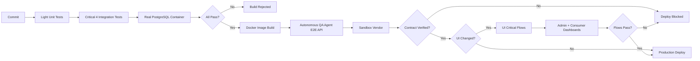

# Steller v2 — Critical Path and Verified Pipeline

**Status:** Approved  
**Last Updated:** 2026-02-18  
**Authority:** Defines the **Critical Path** and **Verified Pipeline** for Steller v2. Implementation directive: **do not wait for “Weeks 1–2”; implement Financial Invariant Tests (Critical 4) immediately.**

---

## 1. Verified Pipeline (Visual)

### 1.1 Pipeline Stages (Explanation)

| Stage | Priority | What runs | On failure |
|-------|----------|-----------|------------|
| **Commit** | P0 | Light unit tests (business logic only; no DB). | Optional to block commit per policy; not the main gate. |
| **Gate 1 (Critical 4)** | **P0** | Integration tests against a **real DB container**. Validate locking, rollback, idempotency, concurrency. | **HARD STOP** — build rejected. |
| **Build** | P0 | Docker image creation from the same commit that passed Gate 1. | Build fails on compile/image errors. |
| **Gate 2 (E2E API)** | **P0** | **Autonomous QA Agent** runs: places real orders against sandbox vendor, verifies API contract, observes logs/DB. | **Deploy blocked** until E2E pass or explicit override. |
| **Gate 3 (UI)** | **P1** | **Conditional:** Only if UI code changed. Critical user journeys in Admin/Consumer dashboards (login, orders, wallet, API keys). | **Deploy blocked** (UI changes only); skipped for API-only changes. |
| **Deploy** | — | Production release. | — |

**Priority Definitions:**
- **P0 (Critical):** API testing, financial invariants. **Always blocking.** Cannot skip.
- **P1 (Important):** UI testing. **Conditional blocking** (only if UI changed). Can be deferred.

---

## 2. The Critical 4 (Gate 1 Detail)

These four tests **must** run on **every** commit. They are **gatekeepers**; if any fails, the build is rejected.

| ID | Test | What it proves |
|----|------|----------------|
| **T_01** | Atomic Rollback | Insufficient funds → order rejected; wallet balance unchanged. |
| **T_02** | Profit Guard | Negative margin → order rejected. |
| **T_03** | Idempotency | Duplicate RequestId → single debit; same order returned. |
| **T_04** | Concurrency | Concurrent debits complete correctly; no double-spend. |

**Implementation:** Existing tests in `Tests.Integration`: `OrderServiceTests` (T_01, T_02, T_03), `WalletServiceTests` (T_04). Pipeline must run these against a real PostgreSQL instance (e.g. Testcontainers or CI service container); **no in-memory or mocked DB** for Gate 1.

---

## 3. Implementation Directives

### 3.1 Define the Critical Path (Immediate)

- **Do not wait** for a “Phase 1” timeline. Implement and enforce the **Financial Invariant Tests** (Critical 4) immediately.
- **CI configuration:** Add a job that runs the Critical 4 (and only these, if desired for speed) on every push/PR; mark build as failed if any fails.
- **Local:** Developers run the same Critical 4 before pushing; document in README or CONTRIBUTING.

### 3.2 Gate 1 Execution

- **Environment:** Real PostgreSQL (e.g. Docker container in CI; `CustomWebApplicationFactory` with `TEST_DB_CONNECTION` pointing at that DB).
- **No mocking of DB** for these four tests; they must hit real tables and locking.

### 3.3 Gate 2 Execution (E2E API)

- **Trigger:** After a successful build (e.g. on tag or deploy branch).
- **Agent:** Steller QA Orchestrator per [../STELLER_QA_AGENT_PROTOCOL_V2.md](../STELLER_QA_AGENT_PROTOCOL_V2.md).
- **Environment:** Staging or sandbox with sandbox vendor (e.g. Bamboo sandbox); API key from Admin API or pre-provisioned secret.
- **Outcome:** Pass = API contract and order flow verified; Fail = deploy blocked unless explicitly overridden with approval.

### 3.4 Gate 3 Execution (UI) — P1 Priority

- **Priority:** **P1** (Important, not critical). API testing (P0) takes precedence.
- **Trigger:** After Gate 2 passes, **only if UI code changed** (detected via git diff or CI path filters).
- **Scope:** Critical user journeys in Admin Dashboard (port 8080) and Consumer Dashboard (port 8081).
- **Tool:** Playwright (recommended) or Cypress.
- **Flows:** Login, order placement, wallet viewing, API key management (see [UI_TESTING_STRATEGY.md](UI_TESTING_STRATEGY.md)).
- **Outcome:** Pass = UI flows verified; Fail = deploy blocked (UI changes only). **Skipped** for API-only changes.
- **Note:** Gate 3 is **not** a blocker for API-only deployments. Focus remains on **P0: API correctness and financial invariants**.

### 3.5 Test Data Factory

- **Requirement:** Scenario-based generation. See [TEST_DATA_FACTORY_SPEC.md](TEST_DATA_FACTORY_SPEC.md).
- **Examples:** `CreatePartner(balance: 0)` → expect order failure; `CreatePartner(balance: 1000)` → expect success. Factory must support these scenarios for repeatable integration tests.

---

## 4. References

- **QA plan:** [../STELLER_V2_QA_PLAN.md](../STELLER_V2_QA_PLAN.md)
- **QMS (Ledger focus):** [../STELLER_V2_QMS_PLAN.md](../STELLER_V2_QMS_PLAN.md)
- **E2E protocol (API):** [../STELLER_QA_AGENT_PROTOCOL_V2.md](../STELLER_QA_AGENT_PROTOCOL_V2.md)
- **UI testing strategy:** [UI_TESTING_STRATEGY.md](UI_TESTING_STRATEGY.md)
- **Test data factory spec:** [TEST_DATA_FACTORY_SPEC.md](TEST_DATA_FACTORY_SPEC.md)
- **Critical 4 implementation:** Steller backend `Tests.Integration/OrderServiceTests.cs`, `WalletServiceTests.cs`
